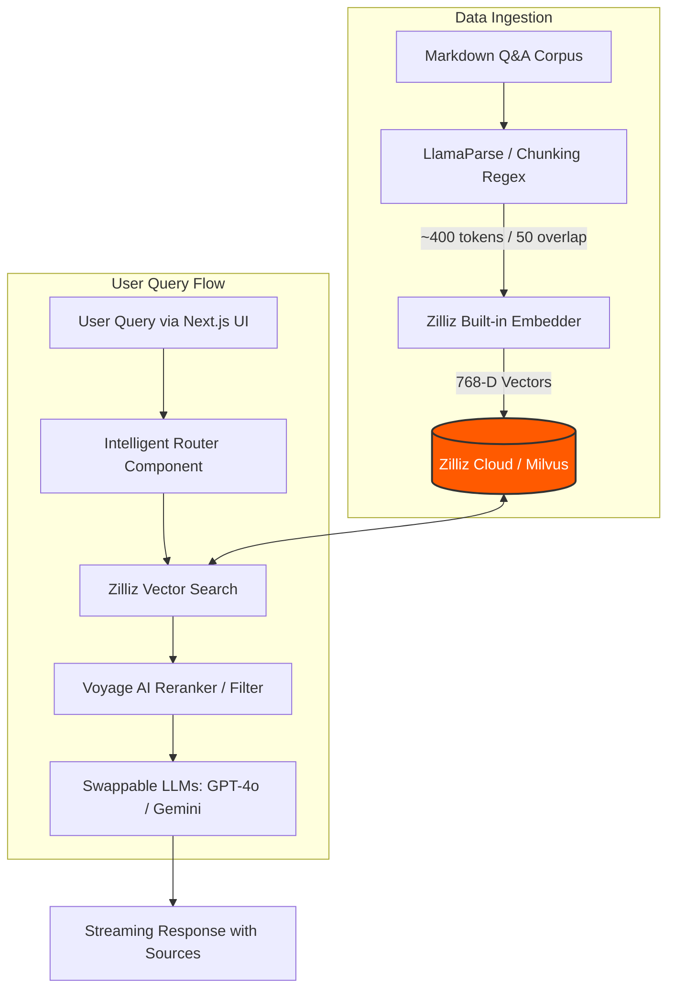
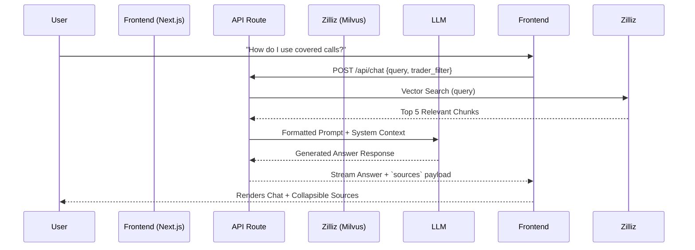
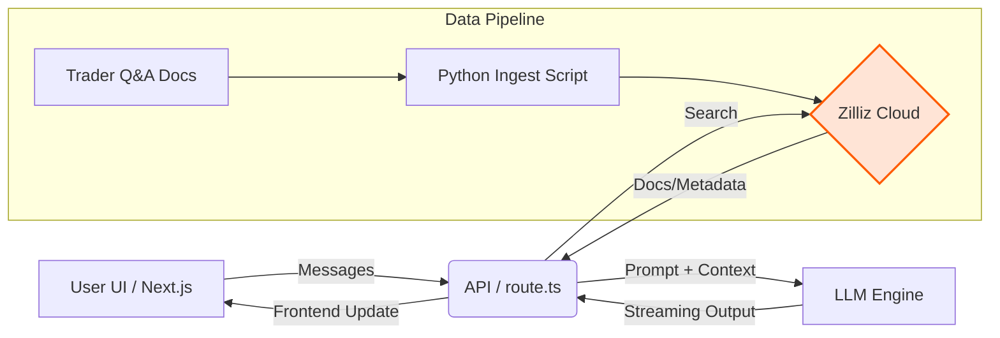

<div align="center">

# 📈 Nu-Finance: Trader Q&A RAG Pipeline 🚀


</div>

## ✨ One-Liner
A high-performance, dual-perspective Retrieval-Augmented Generation (RAG) chatbot specialized in financial markets, powered by LlamaIndex, Zilliz Cloud, and Voyage AI, allowing users to query tactical & structured investment strategies.

---

## 💥 Problem & Impact

Financial markets are nuanced, and generic LLMs frequently hallucinate or lack deep, domain-specific tactical context. Traders and analysts need instantaneous access to vetted, expert insights rather than generic advice.

*   **The Problem:** Traditional search over financial documents loses contextual depth, and raw LLM queries hallucinate on specific trading theses. Furthermore, retail and institutional strategies vastly differ.
*   **The Solution:** A RAG system grounded *exclusively* in a curated corpus of ~950 semantic chunks representing distinct trader profiles (Tactical Opportunist vs. Structured Growth Investor).
*   **The Impact:** Radically reduced research time (minutes to milliseconds) and dramatically increased signal-to-noise ratio for quantitative and qualitative trade execution planning.

> 💡 **Impact Highlight:** Enables semantic cross-comparison of options strategies, specific industry (AI, Nuclear, Cloud) macro analysis, and post-event (e.g., War End) market hedging.

---

## 🌍 Market Context

Driven by the boom in AI and accessible programmatic trading APIs, modern financial workflows are increasingly agentic.
*   **Massive Data Exhaust:** Analysts spend 40%+ of their time parsing unstructured market commentaries, earnings, and news.
*   **RAG as a Differentiator:** Specialized RAG architectures bridge the gap between static firm-knowledge and dynamic query environments. By standardizing queries against established "Trader Personas," financial institutions can institutionalize alpha generation strategies efficiently.

---

## 🏗️ Solution Overview

Nu-Finance is built on a robust, swappable architecture. It fundamentally separates document ingestion from the interactive UI. Raw domain knowledge (Markdown Q&As) is parsed by LlamaIndex/LlamaParse, chunked semantically, embedded using Zilliz’s Built-in Embedding capabilities, and stored in a high-speed Zilliz Cloud Milvus index.

At query time, an intelligent router directs the context (and optional Voyage AI reranking logic) to swappable LLM providers (GPT-4o, Gemini 3.1 Pro, or Mistral) tailored to answer the specific financial paradigm.



---

## 🎥 Demo Summary

The demo showcases the precision of the RAG pipeline retrieving answers from specific themes and trader profiles.

| Demo Parameter | Configuration | Target Outcome |
| :--- | :--- | :--- |
| **User Persona** | Options Trader | Explore "IV Crush" mechanics |
| **Data Filter** | Tactical Opportunist (T1) | Short-dated speculative insights |
| **Vector DB** | Zilliz Cloud `trader_qa` | Millisecond retrieval |
| **Live Switch** | LLM Provider Change | Seamless swap from GPT-4o to Gemini |



---

## 🔍 Multi-Step Trace / Workflow

Watch how the agentic backend processes a complex options query.

<details>
<summary><b>Step 1: Document Processing & Ingestion</b></summary>

- Loads 10+ markdown files (e.g., `doc-1-options-and-swing-trading.md`)
- Splits by Q&A pairs via `**Q\d+.**` regex
- Injects rich metadata (theme, source, valid personas)
- Pushes ~950 vectors to Zilliz `trader_qa` via PyMilvus.

</details>

<details>
<summary><b>Step 2: Semantic Query & Retrieval</b></summary>

- User asks: *"How to size NVDA positions post-earnings?"*
- Next.js backend leverages Zilliz Node.js SDK
- Server-side built-in embedding creates vector representation
- `COSINE` distance metric retrieves top-K nodes

</details>

<details>
<summary><b>Step 3: Reranking & LLM Generation</b></summary>

- Voyage AI visually structures relevance
- Context string built: `[Theme: AI/GPU Infrastructure] {text_content}`
- GPT-4o streams grounded response referencing *Tactical Opportunist* rules.

</details>

---

## 💬 Prompt/Response Flow (User Facing)

**Input Prompt:**
```text
What does VDE vs XLE exposure look like post-war according to the Structured Growth Investor?
```

**System Output:**
```markdown
Based on the Structured Growth Investor (T2) framework:

The approach to energy exposure post-war heavily favors qualitative factors and long-term supply/demand dynamics over short-term price shocks.

- **VDE (Vanguard Energy ETF):** T2 utilizes VDE for broader, cap-weighted exposure to capture secular growth in domestic production frameworks without picking single winners.
- **XLE (Energy Select Sector SPDR):** Preferred for concentrated bets on majors (XOM, CVX) when balance sheet health and consistent dividend yields are prioritized over broad exploration exposure.

*Sources:* 
- `vde-xle-war-end-qa.md` (Score: 0.89)
```

---

## ⚙️ Logs / Agent Logs / System Logs

> 💡 **Tip:** Transparent tracing ensures confidence in the RAG pipeline's grounding.

<details>
<summary><b>Zilliz Retrieval Log (JSON)</b></summary>

```json
{
  "event": "zilliz_vector_search",
  "collection": "trader_qa",
  "latency_ms": 42,
  "top_k_returned": 3,
  "results": [
    {
      "id": 8392110293,
      "distance": 0.912,
      "metadata": {
        "source_file": "doc-1-options-and-swing-trading.md",
        "theme_name": "Options Basics",
        "trader_1_present": true
      }
    }
  ]
}
```

</details>

---

## 📊 Metrics to Highlight

| Metric | Value | Description |
| :--- | :--- | :--- |
| **Vector DB Storage** | ~950 vectors | Uses < 0.1% of Zilliz free tier |
| **Ingestion Cost** | $0.00 | Handled entirely by Zilliz built-in embeddings (768D) |
| **Retrieval Speed** | < 50ms | Real-time context gathering via Milvus |
| **Chunk Overlap** | 50 tokens | Ensures semantic continuity between markdown splits |

---

## 🏛️ System Architecture



---

## 📂 Files to Show During Demo

- `scripts/ingest_trader_qa.py` — Showcases PyMilvus integration and automated chunking metadata logic.
- `app/api/chat/route.ts` — Highlights the elegance of the Node SDK vector search combined with LLM generation.
- `lib/zilliz.ts` — The MilvusClient singleton managing the database connection.
- `docs/trader-qa/trader-profiles-updated.md` — The seed knowledge defining the personas.

---

## 🤝 Sponsor / Framework / API Integration

- **[Zilliz Cloud / Milvus](https://zilliz.com/)**: Serves as the core vector database, utilizing built-in server-side embedding models (`BAAI/bge-base-en-v1.5`) to eliminate extraneous API costs.
- **[LlamaIndex](https://www.llamaindex.ai/)**: Provides the structural intelligence for semantic chunking and advanced ingestion flows.
- **[Voyage AI](https://www.voyageai.com/)**: Optional advanced reranking capabilities for complex query disambiguation.
- **LLM Routing**: Supports OpenAI (`GPT-4o`), Google (`Gemini 3.1 Pro`), and `Mistral`.

---

## 🚀 Quick Setup

Ensure you have Node.js 18+ and Python 3.10+ installed.

### 1. Environment Configuration
Create a `.env.local` based on `.env.example`:
```bash
ZILLIZ_CLOUD_URI=https://<cluster-id>.serverless.gcp-us-west1.cloud.zilliz.com
ZILLIZ_API_KEY=your_zilliz_token
ZILLIZ_COLLECTION=trader_qa

OPENAI_API_KEY=sk-yourkey
# Add Voyage/Gemini keys as needed
```

### 2. Ingest the Data 
```bash
cd backend
pip install pymilvus openai
python scripts/ingest_trader_qa.py
```

### 3. Launch the Application
```bash
cd frontend
npm install
npm run dev
```
 Navigate to `http://localhost:3000` 🎯

---

## 💻 Run Modes

**Development Mode (UI & Hot-Reload):**
```bash
npm run dev
```

**Ingestion Only (Headless Indexing):**
```bash
python scripts/ingest_trader_qa.py --force-rebuild
```

---

## 📦 Packaging & Release Instructions

1. **Verify Environment**: Ensure all `.env` placeholders are secure and not hardcoded.
2. **Build Next.js Bundle**:
   ```bash
   npm run build
   ```
3. **Deploy**: The Next.js app is optimized for Vercel. 
   ```bash
   npx vercel --prod
   ```
4. **Vector DB Lifecycle**: For production, transition from Zilliz Free-Tier to a Dedicated cluster if exceeding 1M vectors.

---

## ✅ Validation Checks

Run the following checks before committing:

```bash
# Type-check TypeScript files
npm run type-check

# Run basic linting
npm run lint

# Validate chunk generation logic
python -m pytest scripts/tests/
```

---

## 🗂️ Project Structure

```text
nu-finance/
├── frontend/
│   ├── app/
│   │   ├── api/chat/route.ts       # Main RAG API route
│   │   ├── page.tsx                # Client Chat Application
│   │   └── components/             # SourcesPanel, ChatMessage
│   ├── lib/
│       ├── zilliz.ts               # Milvus connection handler
│       └── rag.ts                  # Query structuring logic
├── backend/
│   ├── scripts/
│   │   └── ingest_trader_qa.py     # Embeds and loads Markdown files
│   └── docs/trader-qa/             # Root Knowledge Base (.md files)
└── README.md
```

---

## ⚠️ Notes & Disclaimers

> ⚠️ **Warning:** Placeholder text for API Keys must NEVER be committed to version control. Always use `.env` files.
> 
> ⚖️ **Disclaimer:** This pipeline retrieves financial strategy information strictly for educational and demonstrative purposes based on its underlying markdown corpus. The LLM outputs (T1/T2 perspectives) do **not** constitute real financial or investment advice. Trade execution driven by LLM agents carries extreme risk.
