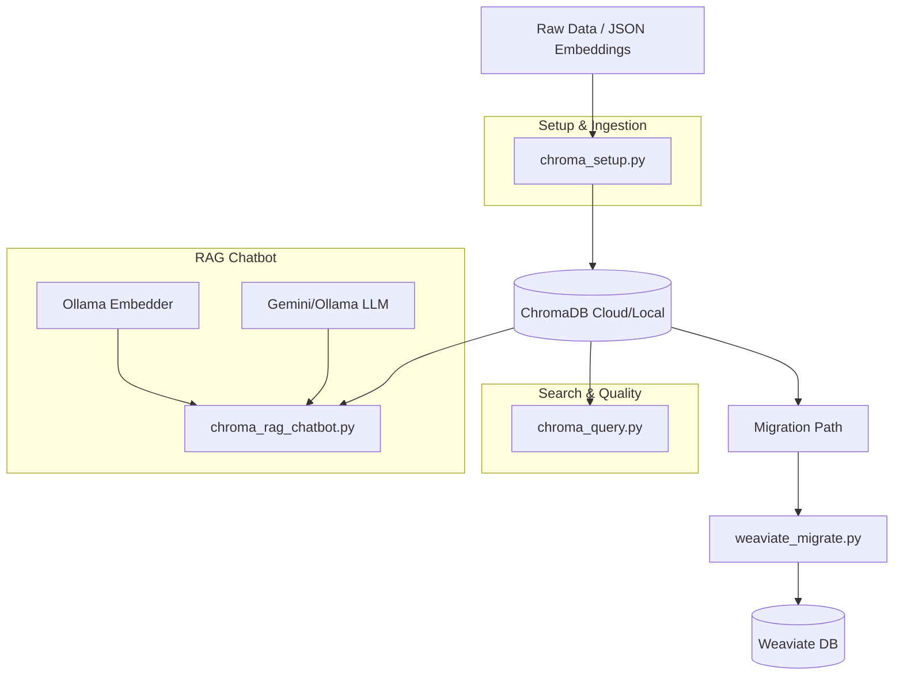

# ChromaDB RAG Pipeline Documentation

This document provides a comprehensive overview of the ChromaDB-backed Retrieval-Augmented Generation (RAG) pipeline within the `ai-text-opt` project.

## Pipeline Overview

The pipeline is designed for semantic search and conversational AI, with a specific focus on high-quality embeddings and a clear migration path to Weaviate.

---

## 1. Data Ingestion & Setup (`chroma_setup.py`)

The ingestion phase transforms pre-computed embedding files into searchable ChromaDB collections.

- **Datasets**: Manages five primary collections: `ideas`, `qa_data`, `grief`, `love_connection_ideas`, and `love_connection`.
- **Loading**: Reads from JSON files containing both text content and 768-dimensional vectors.
- **Collection Management**: Handles the creation and deletion of collections, ensuring fresh data is imported using a cosine similarity space.
- **Quality Reporting**: Calculates critical metrics for embeddings, including:
    - **Zero Embeddings**: Checks for degenerate vectors.
    - **Avg Pairwise Cosine**: Measures how well-spread the embeddings are (avoiding collapse).
    - **Avg NN Distance**: Measures how tightly semantic clusters are formed.
- **Migration Export**: Generates Weaviate-compatible JSON exports for future-proofing.

---

## 2. Query & Analysis Interface (`chroma_query.py`)

A specialized interface for testing retrieval performance and monitoring embedding health.

- **Unified Search**: Allows searching across all collections simultaneously to see how different datasets respond to a single query.
- **Direct Vector Search**: Supports searching with explicit query embeddings to bypass potential dimensionality mismatches from built-in embedders.
- **Interactive CLI**: Provides a command-line environment for developers to refine search parameters and view raw distances.

---

## 3. RAG Chatbot Engine (`chroma_rag_chatbot.py`)

The culmination of the pipeline, providing a conversational interface backed by the vector database.

### Retrieval Layer (`ChromaRetriever`)
- **Dual-Model Support**: Uses **Ollama** (`nomic-embed-text`) for query embedding to ensure parity with stored vectors, then queries **ChromaDB**.
- **Cross-Collection Retrieval**: Can aggregate results from multiple collections, sorting by similarity distance to find the absolute best context.

### Generation Layer (`LLMBackend`)
- **Gemini (Default)**: Leverages `gemini-2.0-flash` for high-quality, thoughtful responses.
- **Ollama (Local)**: Allows for fully local inference using models like `dolphin-phi`.

### Architecture Features
- **Protocol-Based**: Uses a `VectorRetriever` abstract class, making it trivial to swap ChromaDB for Weaviate by simply changing the implementation class.
- **Config-Driven**: Behavior is controlled entirely through environment variables and CLI flags.

---

## Connected Files & Directories

| File / Path | Role | Description |
| :--- | :--- | :--- |
| `chroma_setup.py` | **Core** | Initialization, data loading, and quality reporting. |
| `chroma_query.py` | **Core** | Interactive search and analysis interface. |
| `chroma_rag_chatbot.py` | **Core** | Main RAG application engine. |
| `.env` | Config | API keys, host URLs, and model settings. |
| `ideas_embeddings.json` | Data | Pre-computed embeddings for the 'ideas' corpus. |
| `qa_embeddings.json` | Data | Pre-computed embeddings for Q&A data. |
| `grief_thoughts_embeddings.json` | Data | Pre-computed embeddings for grief-related content. |
| `weaviate_migrate.py` | Tools | Script to migrate ChromaDB data to Weaviate. |
| `chromadb_storage/` | Storage | Local persistent storage for ChromaDB (if running locally). |
| `requirements.txt` | Dependency | Lists `chromadb`, `langchain-google-genai`, etc. |

---

## Migration Path to Weaviate

The pipeline is explicitly designed to be transitional. 
1. **Export**: `chroma_setup.py` creates `weaviate_*.json` files.
2. **Infrastructure**: `docker-compose.yml` spins up a local Weaviate instance.
3. **Migration**: `weaviate_migrate.py` imports the exported JSON files.
4. **Activation**: The chatbot can be switched by passing `--retriever weaviate`.
